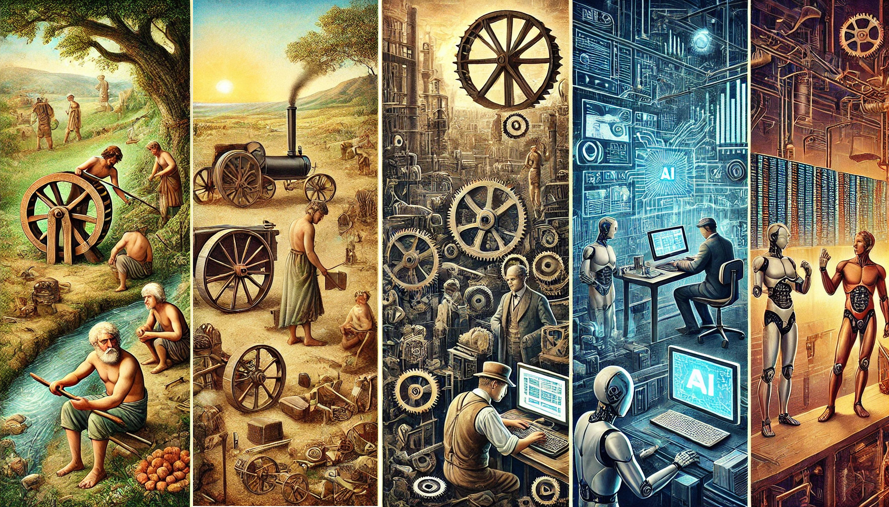

<!-- .slide: data-state="nologo-slide" style="text-align: center" -->
# Quoi ?

* qu'est ce que l'automatisation ?

<!-- .slide: data-state="nologo-slide" style="text-align: center" -->
# Historique de l'automatisation 

* Le désir de faciliter le travail humain est aussi ancien que l'humanité elle-même

 <!-- .element: width="200px" -->
