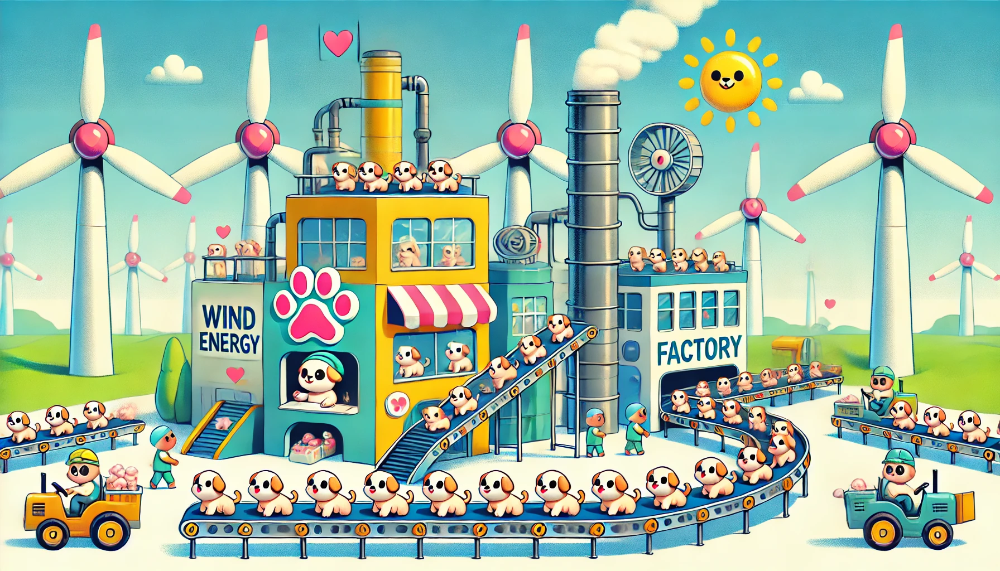

<!-- .slide: data-state="nologo-slide" style="text-align: center" -->
#  Dans l'industrie

* Tp pilotage d'une ligne de production 

 <!-- .element: width="100px" -->


Nous sommes en 2077 et contre toute attente le monde n'est pas cyberpunk mais bien une utopie verte ou l'on produit des jouet pour enfant en préservant l'environnement,
cependant si c'est une utopie pour les petits animaux ça ne l'est pas pour les automaticien car les pratiques informatiques ne sont toujours pas unifiés et vous devez faire preuve de créativité pour faire tournée votre usine de chien en peluche dans le trégor, toute en respectant les consignes d'économie d'énergie.


## Exercice 1

Votre ligne de production est relativement ancienne, mais heureusement elle est tous de même pilotable sommairement via une connection ssh à l'adresse suivante **ssh localhost -p 5050** , 
voici la documentation des commandes réalisable sur la ligne : 
```
show lines
    affiche la liste des différentes ligne de production et leur statut
lines X activate/deactivate
    change le statut de la ligne de production, en l'activant ou en la désactivant
show lines power consumption
    affiche la consommation en énergie de chaque ligne de production
production plant activate/deactivate
    Allume ou éteint l'usine de production complète
```

**au regard de cette documentation, écrivez un script python permettant d'activez/désactivez une ligne de production donnée, et de vérifier son état (on/off)** 


## Exercice 2

Les consignes d'économie d'energie de 2077 sont claires : Article 422.1 - 4 : les jouets en peluche doivent être produit à l'aide d'energie éolienne.
cette énergie est récupérables sur des éoliennes fournies par le gouvernement, seulement voilà, la production de batterie ayant été stoppé en 2050 car jugée trop polluante cette energie ne peut pas être stocké,
heureusement grâce à vos contact chez enedouze et chez meteo-fronce vous avez récupéré :

le fichiers de référence du calcul de production d'energie selon la force du vent en MWh
```
    energie-eoliens.csv
      un fichier csv qui décris les puissances éléctrique obtenues selon la force du vent
```

ainsi que les commandes API de météo-fronce permettant de récupéré la force du vent prévu pour une durée donnée, dans les régions bretonnes

```
   /wind_force
        renvoie la liste des force de vent pour les 30 prochaine seconde dans chaque régions
```
**au regard de cette documentation, écrivez un script python permettant de récupérer la puissance qui sera générée par les éoliennes du trégor pour les 30 prochaine seconde** 

## Exercice 3


