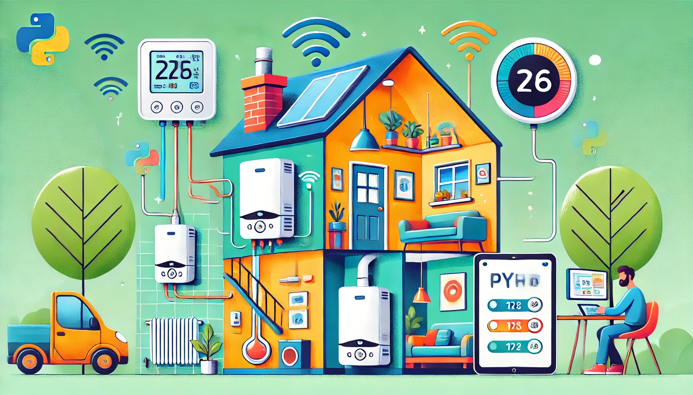

<!-- .slide: data-state="nologo-slide" style="text-align: center" -->
# Où ?

* TP - Réalisez des exemples d'automatisation au quotidien, dans l'IT, dans l'industrie

<!-- .slide: data-state="nologo-slide" style="text-align: center" -->
# Au Quotidien 

* Tp pilotage de thermostat et d'une chaudière connecté

 <!-- .element: width="100px" -->


## Exercice 1

Vous êtes féru d'automatisation et de domotique, vous avez donc investi dans un kit complet comprenant thermostat et chaudière connecté, 
cependant l'application qui permet de piloter ces éléments n'est pas compatible avec votre téléphone, et vous souhaiteriez pouvoir piloter tous ce système via votre ordinateur.
Grâce à vos contact chez chaudierepresdechezvous.com vous avez réussi à obtenir la documentation de l'API dont voici un extrait :

au regard cette documentation, rédigez un script python qui permet de consultez la température d'une pièce de la maison en particulier

```De quelle pièce de la maison souhaitez vous connaitre la temperature ?
   Salle de bain
   Il fait XX dégré dans la salle de bain 
``` 


* **Je souhaite éteindre mes appareil pour économiser de l'energie, toutes les prises de ma maison sont donc pilotable par internet, j'éteins tous**
* **j'ai un détecteur de niveau en haut de ma baignoire, tant que la baignoire n'est pas rempli, l'eau coule**
